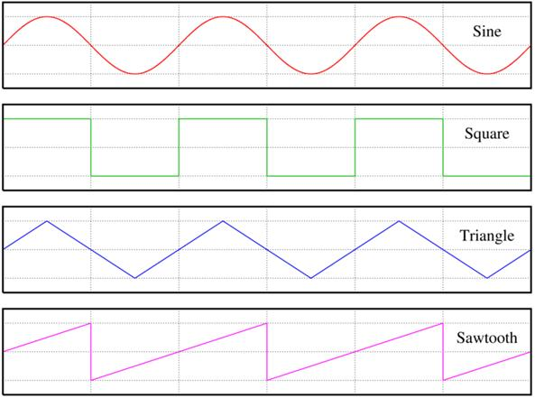

# Projekt HandTone

**Cel projektu**

Mój projekt polega na stworzeniu modelu, który rozpoznaje konkretne gesty mojej ręki i przypisuje im odpowiednie nuty muzyczne, które są odtwarzane.

**Kolejność odpalania plików**

1. By samodzielnie wprowadzić swoje dane trzeba najpierw odpalić **collect_img.py.** Potem dla wybranych przez siebie ruchów powoli pokazywać na kamerce różne potencjalne perspektywy ich (na przykład zbliżać i oddalać rękę oraz wyginać ją w różne strony). Po odpaleniu programu powinnien powstać folder data, który będzie zawierał zdjęcia gestów.

2. Następnie musimy stworzyć sam dataset. Zrobimy to przez odpalenie pliku **create_dataset.py**. Po wykonaniu programu powinien powstać data.pickle.

3. Następnie odpalamy plik **train_classifier.py** by wytrenować nasz classifier. Po wykonaniu powinien powstać plik model.p.

4. Teraz możemy odpalić nasz ukończony projekt. Robimy to za pomocą **inference_classifier.py**.

**Teoria Muzyczna**

Każda pojedyncza nuta ma swoją nazwę, a w tym projekcie będziemy korzystać z nazewnictwa z krzyżykami, także istotne są tylko **C, C#, D, D#, E, F, F#, G, G#, A, A# i H**. Nuty z krzyżykiem odczytujemy z końcówką "-is", więc mamy na przykład: fis, cis, gis, dis etc.

Oktawa to odległość między kolejnymi takimi samymi dzwiękami na klawiaturze. Na zdjęciu powyżej widać przykład oktawy od C do C. Oznaczenie oktawy w odniesieniu do dźwięków, np. C4 lub B7, określa, jak wysoko lub nisko na klawiaturze jest dany dźwięk (w tym programie zaczynając każdą nową oktawę od C). W moim projekcie **można wybierać oktawy od 0 (najniższa) do 8 (najwyższa)**.

Podstawowymi falami akustycznymi, od których zaczęła się synteza dźwięku, są **cztery rodzaje fal**. W moim projekcie można wybrać, którą z nich chcesz usłyszeć:

**Obsługa programu**

Do wybierania dźwięku używamy odpowiednich gestów dłonią. Ważne jest, aby podczas korzystania z programu była widoczna tylko **jedna ręka**. W przeciwnym razie program może być mniej trafny.

Aby zmienić oktawę, naciśnij klawisz od 0 do 8 na klawiaturze odpowiednio.

By zamkąć program naciśnij q na klawiaturze.

Aby zmienić rodzaj fali, naciśnij odpowiedni klawisz na klawiaturze:

| Klawisz do naciśnięcia | Rodzaj fali |
| ---------------------- | ----------- |
| z                      | sawtooth    |
| x                      | square      |
| c                      | sine        |
| v                      | triangle    |

**Przygotowane patche:**

Dla osób, które nie chcą samodzielnie podejmować decyzji, przygotowałam również 4 patche do przetestowania:

| Klawisz do naciśnięcia | Rodzaj fali | Oktawa |
| ---------------------- | ----------- | ------ |
| a                      | sawtooth    | 4      |
| s                      | square      | 5      |
| d                      | sine        | 6      |
| f                      | triangle    | 7      |
