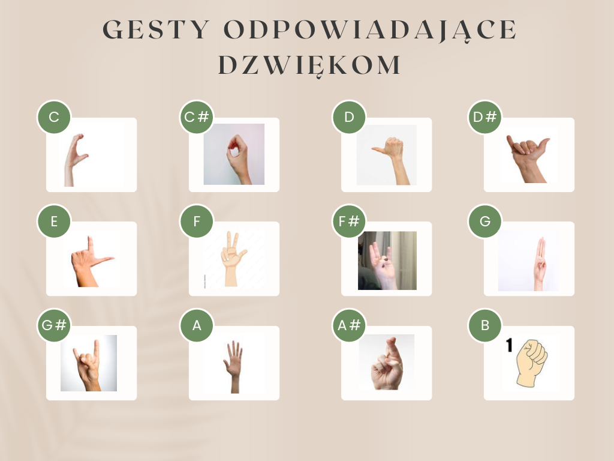

# HandTone

## Table of Contents
1. [Description](#description)
2. [Concepts Used](#concepts-used)
3. [Walkthrough](#walkthrough)
4. [Setup](#setup)

## Description
**HandTone** is a machine learning-based project that recognizes specific hand gestures and translates them into musical notes, which are then played back. Using **computer vision and audio synthesis**, the program detects hand gestures via a webcam and maps them to corresponding notes, allowing for an interactive musical experience.

## Concepts Used
In this project, the following technologies and concepts are utilized:
- **Computer Vision with MediaPipe**: Detects hand positions and extracts keypoints.
- **Machine Learning with Random Forest Classifier**: Trains a model to classify hand gestures.
- **Real-time Gesture Recognition**: Uses a webcam to recognize and respond to hand gestures dynamically.
- **Audio Synthesis with Pygame & NumPy**: Generates musical tones based on classified gestures.
- **Dataset Collection and Processing**: Captures images of hand gestures and converts them into training data.
- **Key Mapping for Interaction**: Users can switch between octaves and waveforms using keyboard inputs.

## Walkthrough

### 1. Collecting Gesture Data
To create a dataset for gesture recognition, run **collect_img.py**. This script captures hand gestures through a webcam, saving images in the `data` folder.



- Users should slowly move their hand in various orientations to provide diverse training samples.
- Ensure only one hand is visible for accurate classification.

### 2. Creating the Dataset
Run **create_dataset.py** to process the collected images and extract key hand landmarks.
- This script uses **MediaPipe Hands** to detect hand keypoints.
- The processed data is saved in `data.pickle` for training.

### 3. Training the Classifier
Run **train_classifier.py** to train a machine learning model using the collected dataset.
- The script uses a **Random Forest Classifier** from `sklearn`.
- The trained model is saved as `model.p`.

### 4. Running the HandTone Program
Run **inference_classifier.py** to start the real-time gesture-to-music conversion.
- The script loads the trained model and continuously detects hand gestures.
- Recognized gestures trigger corresponding musical notes.
- Notes are played using **Pygame's audio engine**.

### 5. Musical Theory & Controls
HandTone supports the following musical notes: **C, C#, D, D#, E, F, F#, G, G#, A, A#, B**.


- **Octave Selection:** Press keys **0–8** to switch octaves.
- **Waveform Selection:** Choose from four types of waveforms:

  | Key | Waveform  |
  |----|-----------|
  | Z  | Sawtooth  |
  | X  | Square    |
  | C  | Sine      |
  | V  | Triangle  |

- **Predefined Sound Patches:**

  | Key | Waveform | Octave |
  |----|-----------|--------|
  | A  | Sawtooth  | 4      |
  | S  | Square    | 5      |
  | D  | Sine      | 6      |
  | F  | Triangle  | 7      |

- **Exit the Program:** Press **Q**.

## Setup
To set up and run HandTone, follow these steps:

1. Install the required dependencies:
   ```sh
   pip install opencv-python mediapipe numpy pygame scikit-learn matplotlib
   ```
2. Run the scripts in the following order:
   ```sh
   python collect_img.py   # Collect hand gesture images
   python create_dataset.py   # Process the dataset
   python train_classifier.py   # Train the model
   python inference_classifier.py   # Start real-time gesture recognition
   ```
3. Ensure the webcam is working and place your hand in front of the camera to play music!

---

Enjoy making music with HandTone! 🎶
